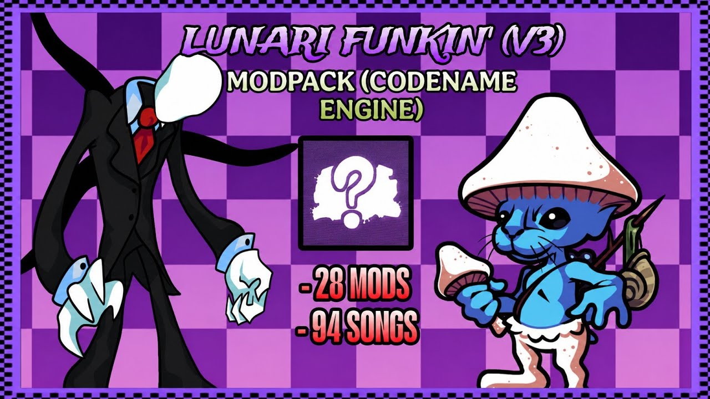

<div align="center">
  
</div>

<div align="center">
  
</div>

<br/>

<div align="center">

[](https://www.youtube.com/@Netuke)
[](https://tukify.pages.dev/)

</div>

<div align="center">


</div>

---


**Modder · Developer · Creator · Brazil 🇧🇷**

> *"I enjoy tinkering with mods, posting APKs, and sharing what I find interesting."*

Hey! I'm **Netuke** — a hobbyist dev from Brazil who makes **FNF mods** using Haxe with Codename Engine & Psych Engine, tinkers with Java and Python, and builds stuff just for fun.

I also made my own multilingual site, [Tukify](https://tukify.pages.dev/). Still learning every day. 😆

```
◈  Handle   →  Netuke
◈  Origin   →  Brazil 🇧🇷
◈  Focus    →  Mods / APKs / Dev
◈  Stack    →  Haxe · Java · Python
◈  Status   →  Always tinkering 🔧
```

<br clear="right"/>

---

## 🛠️ Technologies

<div align="center">


</div>

---

## 🎮 What I Do



- 🎵 **FNF Mods** — Creating and porting mods with Codename Engine & Psych Engine
- 📦 **APKs** — Sharing and building Android packages
- 🌐 **Web** — Built [Tukify](https://tukify.pages.dev/), my own multilingual site
- ☕ **Java / Python** — Scripting and automating stuff when needed
- 📺 **YouTube** — Sharing mods, APKs, and whatever I find cool → [@Netuke](https://www.youtube.com/@Netuke)

<br clear="right"/>

---

## 🗡️ Featured Projects

<div align="center">

<a href="https://gamebanana.com/mods/666980">
  
</a>

</div>

---

<div align="center">

😸 *If you like what I do — check out my [YouTube](https://www.youtube.com/@Netuke) or visit [Tukify](https://tukify.pages.dev/)!*

</div>